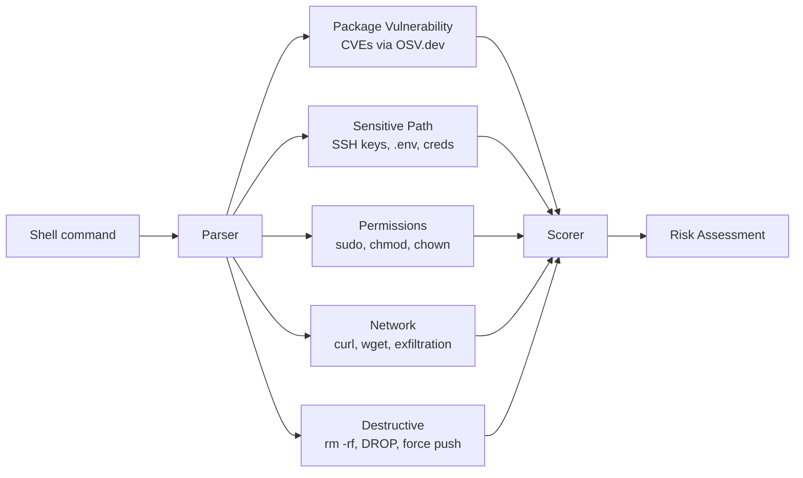
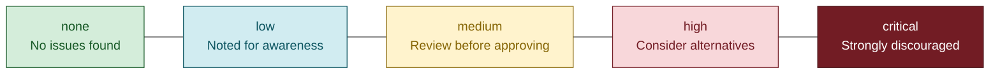
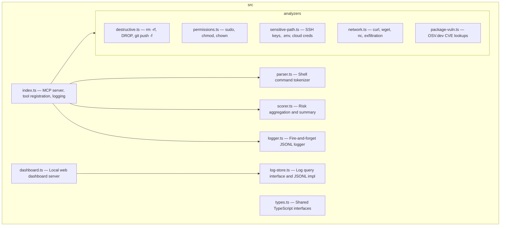

# Flare

Runtime risk assessment for AI coding agents. Flare intercepts shell commands before execution and provides contextual security analysis — so you see exactly what a command does and why it might be dangerous, right in the conversation.

This is not an enforcement tool. It does not block commands. It makes informed consent possible by surfacing risks that developers would otherwise miss.

## Quickstart

### 1. Install dependencies

```bash
npm install
npm run build
```

### 2. Add to Claude Code

Add Flare as an MCP server in your `.claude/settings.json`:

```json
{
  "mcpServers": {
    "flare": {
      "command": "node",
      "args": ["/absolute/path/to/flare/dist/index.js"]
    }
  }
}
```

### 3. Add the hook to your project's CLAUDE.md

```
Before executing any shell command, call flare.assess_command with the command and current working directory.
```

That's it. Flare will now analyze every command before you approve it.

## How it works

When an AI agent wants to run a shell command, Flare intercepts it and runs five analyzers in parallel:



Each command gets a risk level: `none`, `low`, `medium`, `high`, or `critical`.

When an API call (e.g. OSV.dev) fails or times out, the assessment is marked `partial: true` so you know the score may be incomplete.

## Example

You ask Claude to install an older version of express:

```
Claude: I need to install an older version of express for compatibility.
[calls assess_command("npm install express@4.16.0", "/home/dev/app")]

⚠️ MEDIUM RISK: express@4.16.0 has 2 known vulnerabilities:
• CVE-2024-29041 (medium): Open redirect via malicious URL
Recommendation: Consider using a newer version with known vulnerabilities patched.

Shall I proceed with 4.16.0 or upgrade to the latest?
```

## Risk levels



## Logging

Every `assess_command` call is logged to a JSONL file at `~/.flare/logs/assess.jsonl`. Each line contains the command, working directory, full assessment, and timing. Logging is fire-and-forget — it never delays the response.

Configure the log path in `config.json`:

```json
{
  "logFile": "~/.flare/logs/assess.jsonl"
}
```

Set `"logFile": false` to disable logging.

## Dashboard

View logged assessments in a local web dashboard:

```bash
npm run dashboard
```

Opens at `http://localhost:6040`. Supports filtering by risk level, action, search text, and time range. Polls for new entries automatically.

## Configuration

Flare works with zero configuration. To customize, edit `config.json`:

```json
{
  "actionPolicy": {
    "none": "run",
    "low": "run",
    "medium": "warn",
    "high": "ask",
    "critical": "ask"
  },
  "sensitivePatterns": ["~/.myapp/secrets/*"],
  "packageAllowlist": ["lodash@4.17.21"],
  "osvTimeout": 1500,
  "safeHosts": ["internal.corp.com"],
  "commandAllowlist": ["echo *"],
  "logFile": "~/.flare/logs/assess.jsonl"
}
```

- **actionPolicy** — Maps risk levels to actions: `run` (silent), `warn` (show summary), `ask` (require confirmation)
- **sensitivePatterns** — Additional glob patterns to flag as sensitive
- **packageAllowlist** — Packages to suppress vulnerability warnings for
- **osvTimeout** — Milliseconds to wait for OSV.dev API (default: 1500)
- **safeHosts** — Hostnames to exclude from network exfiltration warnings
- **commandAllowlist** — Glob patterns for commands to skip analysis entirely
- **logFile** — Path to JSONL log file, or `false` to disable logging

## Development

```bash
npm install          # Install dependencies
npm run build        # Compile TypeScript
npm test             # Run tests
npm run dev          # Run with tsx (no build step)
npm run dashboard    # Launch log dashboard
```

## Architecture



## Requirements

- Node.js 18+
- Any MCP-compatible AI agent (Claude Code, Codex CLI)
